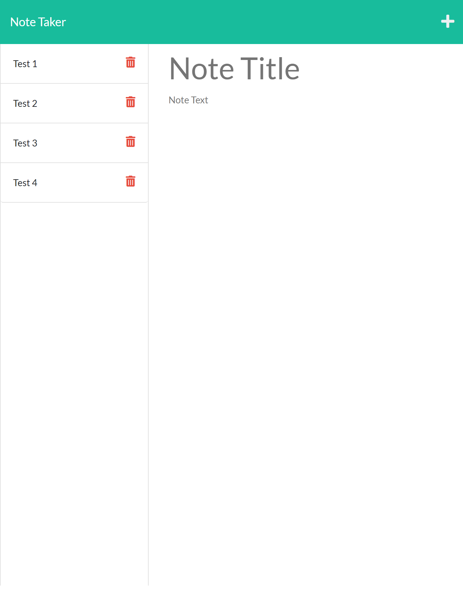

# NOTE-TAKER

## Project Description

AS A small business owner
I WANT to be able to write and save notes
SO THAT I can organize my thoughts and keep track of tasks I need to complete

## Acceptance Criteria

GIVEN a note-taking application

1. WHEN I open the Note Taker
   THEN I am presented with a landing page with a link to a notes page
2. WHEN I click on the link to the notes page
   THEN I am presented with a page with existing notes listed in the left-hand column, plus empty fields to enter a new note title and the note’s text in the right-hand column
3. WHEN I enter a new note title and the note’s text
   THEN a Save icon appears in the navigation at the top of the page
4. WHEN I click on the Save icon
   THEN the new note I have entered is saved and appears in the left-hand column with the other existing notes
5. WHEN I click on an existing note in the list in the left-hand column
   THEN that note appears in the right-hand column
6. WHEN I click on the Write icon in the navigation at the top of the page
   THEN I am presented with empty fields to enter a new note title and the note’s text in the right-hand column

## Installation

run

```
npm install
```

on the root folder. Then run

```
node server.js
```

to start the server.

Then enter

```
http://localhost:3001/
```

on your browser

## Screenshot

How my website looks like



